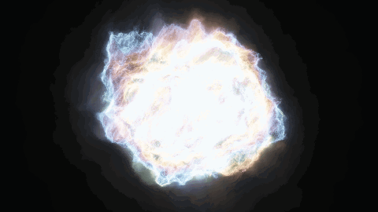
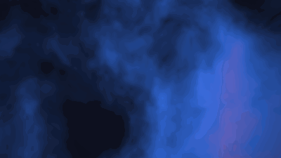
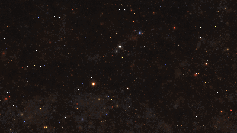

# Shader Playground

Browser-side WebGL shader experiments — **scroll-reactive** and **image-distortion**
effects you can drop onto any web page. Built with [Vite](https://vitejs.dev/) +
[OGL](https://github.com/oframe/ogl): close to raw GLSL (easy to adapt
[Shadertoy](https://www.shadertoy.com/) code), no WebGL boilerplate, instant
shader hot-reload.

**🔗 Live:** [shader-olive.vercel.app](https://shader-olive.vercel.app) · everything
runs 100% client-side — no backend, no build step at runtime.



<sub>*Tribulence 3D running live in the browser — one of five effects below.*</sub>

---

## The effects

| | |
|---|---|
|  **Image distortion** — a ripple lens distorts the image with chromatic aberration, following the mouse and energized by scroll velocity. |  **Scroll transition** — scrolling a card through the viewport dissolves one image into another along an organic noise front. |
|  **Scroll flow** — a fractal-noise field whose palette shifts with scroll progress, turbulence rises with scroll velocity, and flow bends toward the mouse. |  **Tribulence 3D** — a raymarched volumetric SDF warped by FM noise (WebGL2). *Ported from Shadertoy, by chronos.* |



**Star Nest** — a volumetric starfield you rotate with the mouse.
*Ported from Shadertoy, by Pablo Román Andrioli (Kali), MIT.*

---

## Quick start

```bash
npm install
npm run dev      # http://localhost:5173 — scroll down through the cards
npm run build    # production build to dist/
```

It's a single scrolling page. Hover any card to reveal its name + notes. On the
two photo cards you can **drop in your own image** (see below).

---

## Embedding a single effect

`embed.html` is a second entry point that renders **one** full-viewport,
chrome-less shader chosen by a query param — drop it into any page with an iframe:

```html
<iframe
  src="https://shader-olive.vercel.app/embed?fx=starNest"
  title="star nest"
  loading="lazy"
  style="width:100%;height:480px;border:0;border-radius:12px">
</iframe>
```

- **`?fx=`** — `imageDistortion` · `imageTransition` · `scrollFlow` · `starNest` · `tribulence`
- **Custom images** — `?fx=imageDistortion&src=…` · `?fx=imageTransition&from=…&to=…`
- **`?speed=`** — animation time scale; `?speed=0` renders a paused still
- Scroll-driven effects (`scrollFlow`, `imageTransition`) **auto-animate** since an
  embed has no page scroll; `imageDistortion` **auto-roams** its ripple until you
  move the mouse. See [`src/embed.js`](src/embed.js).
- Each iframe is its own WebGL context — fine for one or a few, but avoid stacking
  many heavy ones (especially `tribulence`) on a single page.

Clean URLs (`/embed` instead of `/embed.html`) are enabled by
[`vercel.json`](vercel.json) (`cleanUrls`).

---

## Bring your own image

**On the site (no upload, fully client-side):** hover a photo card and click its
upload pill (`upload image`, or `image A` / `image B` on the transition), or just
**drag an image file onto the card**. The file becomes a local `blob:` URL fed
straight into the shader texture — nothing leaves the browser. Wiring is in
[`src/lib/upload.js`](src/lib/upload.js); each image card exposes a `setImage()`.

**As a default:** drop a file in `/public` and point the canvas's `data-src` (or
`data-from` / `data-to`) in `index.html` at `/your-file.jpg`. The built-in defaults
pull placeholders from [picsum.photos](https://picsum.photos) with CORS, which
shaders require to sample *cross-origin* textures (local blobs are same-origin, so
no CORS needed).

---

## How it works

Each `<canvas data-fx="…">` in `index.html` becomes a live shader card with its own
WebGL context. [`src/main.js`](src/main.js) maps the `data-fx` name to a factory,
wires uploads on the photo cards, and runs one shared `requestAnimationFrame` loop.
Off-screen cards are culled, so only what's visible renders.

```
├─ index.html              gallery page (the scrolling cards)
├─ embed.html              single chrome-less shader for iframes
├─ vite.config.js          two entry points (main + embed)
├─ vercel.json             cleanUrls for /embed
└─ src/
   ├─ main.js              gallery wiring + render loop
   ├─ embed.js             single-effect embed driver
   ├─ style.css
   ├─ lib/
   │  ├─ input.js          shared scroll / velocity / mouse state
   │  ├─ card.js           canvas sizing, in-view culling, scroll progress
   │  └─ upload.js         drag-drop + file-picker image upload
   ├─ experiments/         one factory per effect: (canvas) => ({ render(t) })
   │  ├─ imageDistortion.js
   │  ├─ imageTransition.js
   │  ├─ scrollFlow.js
   │  ├─ starNest.js
   │  └─ tribulence.js
   └─ shaders/             GLSL (imported with Vite's ?raw)
      ├─ base.vert         full-screen, GLSL ES 1.0
      ├─ base300.vert      full-screen, GLSL ES 3.0 (WebGL2)
      ├─ imageDistortion.frag
      ├─ imageTransition.frag
      ├─ scrollFlow.frag
      ├─ starNest.frag
      └─ tribulence.frag
```

### Editing shaders
Open any file in `src/shaders/` and save — Vite hot-reloads instantly. The tunable
knobs (ripple frequency, noise scale, palette, aberration) sit near the top of each
fragment shader.

### Adding a card
1. Add `src/shaders/myThing.frag`.
2. Add `src/experiments/myThing.js` exporting `(canvas) => ({ render(t, dt) })`
   that creates its own `Renderer({ canvas })` (`dt` is the frame delta in
   seconds — use it for any easing so 120Hz displays behave like 60Hz).
3. Register it in the `factories` map in `src/main.js`.
4. Add a `<section class="card">` with `<canvas data-fx="myThing">` in `index.html`.

### Porting a Shadertoy shader
Shadertoy wraps things in `mainImage(out vec4 c, in vec2 fragCoord)` with globals
like `iTime`, `iResolution`, `iMouse`. To port: rename `mainImage` → `main`, read
the `vUv` varying (already 0..1) instead of `fragCoord/iResolution`, and add the
uniforms you need — the harness feeds `uTime`, `uResolution`, `uMouse`, etc.
Shaders using `round()` or dynamic float loops need GLSL ES 3.0: use `base300.vert`
and prefix the fragment shader with `#version 300 es` (see `tribulence.frag`).

---

## Deploy

Static site — deploys anywhere. This one is on Vercel, which builds it
server-side (local `dist/` output is excluded by `.vercelignore`):

```bash
vercel deploy --prod
```

The demo GIF at the top is generated from the live shader with
[`scripts/make-gif.mjs`](scripts/make-gif.mjs) (headless Chrome → frames → GIF):

```bash
npm run dev                                    # in one terminal
npm run gif tribulence docs/hero.gif 24 90 480 270   # fx out frames intervalMs w h
```

---

## Credits & licensing

The harness, the original effects (image distortion, scroll transition, scroll
flow), and the embed/upload tooling are the author's own, released under the
[MIT License](LICENSE).

Two effects are **ports of third-party Shadertoy shaders**, used with attribution.
Each keeps its original author + license in the `.frag` header and links back to
the source:

- **Star Nest** — by Pablo Román Andrioli (Kali) · [shadertoy.com/view/XlfGRj](https://www.shadertoy.com/view/XlfGRj) · MIT License
- **Tribulence 3D** — by chronos · [shadertoy.com/view/fXj3WG](https://www.shadertoy.com/view/fXj3WG)

> ℹ️ Shadertoy's default license is CC BY-NC-SA 3.0 unless the author states
> otherwise. Check the original shader's terms before any commercial use, and
> keep the attribution intact.

Built with [Vite](https://vitejs.dev/) and [OGL](https://github.com/oframe/ogl).
Placeholder photos from [picsum.photos](https://picsum.photos).
